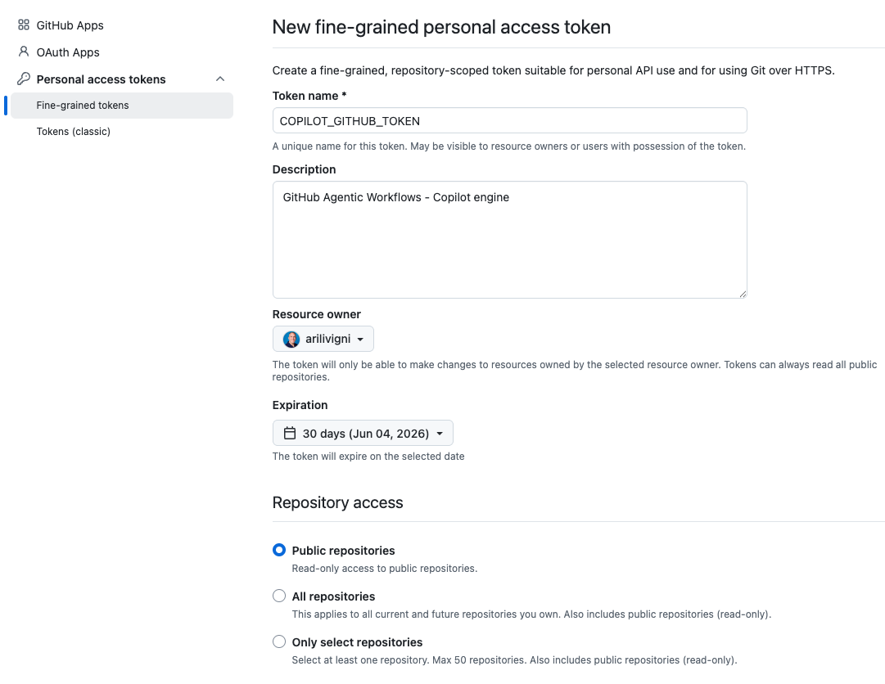
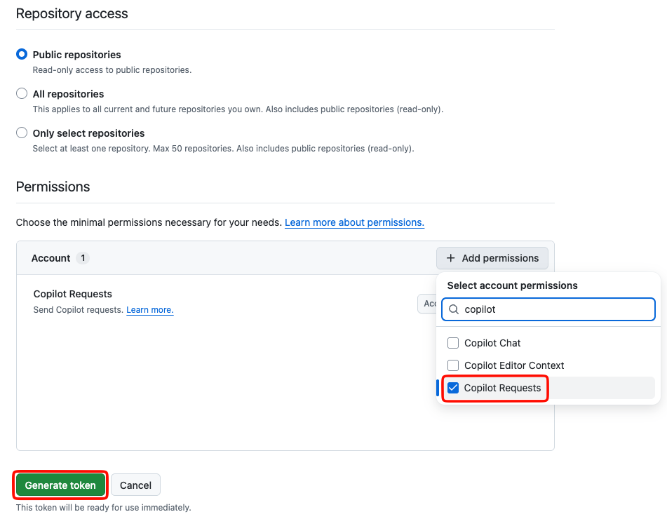
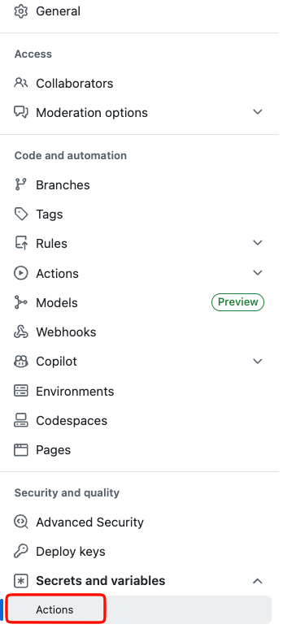
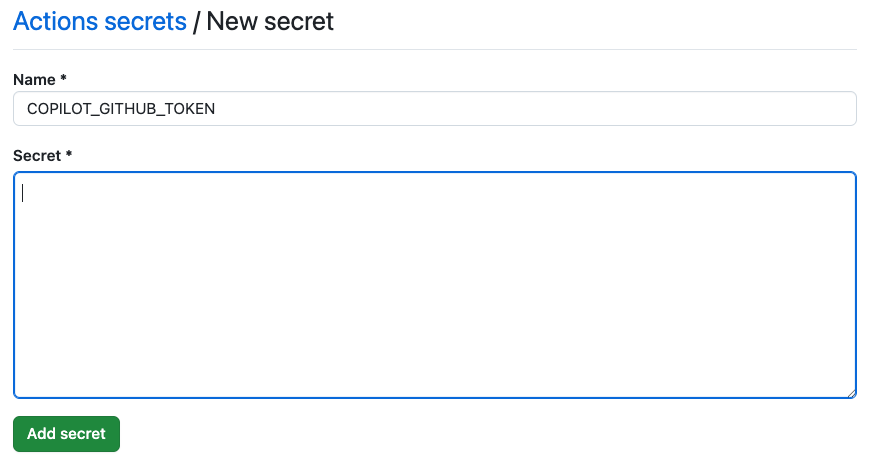

## Step 1: Inicializa los agentic workflows y conoce el pipeline de CI

La Issue Triage API de Mona ya tiene un workflow de **CI** saludable. En este paso, configurarás los agentic workflows de GitHub, ejecutarás la API localmente y confirmarás que el build pase, algo que el reparador(el agentic-workflow / flujo agentico) protegerá más adelante.

### 📖 Teoría: ¿Qué son los agentic workflows?

Los [**agentic workflows**](https://github.github.com/gh-aw/introduction/overview/) son automatización impulsada por IA que puede entender el contexto del repositorio y actuar a partir de instrucciones en lenguaje natural que escribes en markdown.

El comando `gh aw compile` convierte esas instrucciones en markdown en un workflow reforzado de GitHub Actions (`.lock.yml`). Los workflows son de solo lectura por defecto, y las operaciones de escritura pasan por [`safe-outputs`](https://github.github.com/gh-aw/reference/safe-outputs/), acciones como crear issues, comentarios y pull requests.

### 📖 Teoría: Preparar un repositorio para los agentic workflows

El comando [`gh aw init`](https://github.github.com/gh-aw/setup/cli/) agrega los archivos de configuración que un repositorio necesita para los agentic workflows. En este ejercicio, lo usarás en Codespaces, revisarás el pull request de configuración y le harás merge a `main`.

### :keyboard: Actividad: Configura tu Codespace y las herramientas de agentic workflow

Empecemos en el Codespace preconfigurado para este ejercicio. El dev container instala las dependencias de la API, la GitHub CLI, la Copilot CLI, las extensiones de GitHub Copilot para VS Code, y abre una terminal en el editor. Tú mismo instalarás la CLI de agentic workflows en la primera actividad.


1. Usa el botón de abajo para abrir la página **Create Codespace** en una pestaña nueva. Usa la configuración por defecto.

   [](https://codespaces.new/{{full_repo_name}}?quickstart=1)

2. Confirma que el nombre **Repository** sea tu copia del ejercicio, no la plantilla original, y luego haz clic en el botón verde **Create Codespace**.
   - ✅ Tu copia: `/{{full_repo_name}}`
   - ❌ Original: `/codelatamdevcon/agentic-workflows-workshop`

3. Espera a que Visual Studio Code cargue en tu navegador. La configuración del codespace puede tardar unos minutos mientras instala las dependencias y verifica los tests de la Issue Triage API.

4. En la terminal que se abrió en el editor, ejecuta el instalador oficial independiente para instalar o actualizar la extensión CLI de agentic workflows de GitHub.

   > 
   >
   > ```bash
   > curl -fsSL https://raw.githubusercontent.com/github/gh-aw/main/install-gh-aw.sh | bash
   > ```

   Este forma de instalalar la extension independientemente es el camino más fácil en Codespaces porque no depende de la autenticación interactiva de `gh extension install`.

5. Configura el secret de repositorio `COPILOT_GITHUB_TOKEN` que es lo que Copilot usará más adelante en el ejercicio.

   1. [Crea un fine-grained personal access token](https://github.com/settings/personal-access-tokens/new?name=COPILOT_GITHUB_TOKEN&description=GitHub+Agentic+Workflows+-+Copilot+engine+authentication&user_copilot_requests=read) con **Copilot Requests** en **Read**.
      <details>
        <summary>Detalles de permisos del token</summary><br/>
        
        
      </details>
   2. Copia el valor del token.
   3. En tu repositorio del ejercicio copiado, ve a **Settings** > **Secrets and variables** > **Actions**.
   4. Selecciona **New repository secret**.
   5. Nombra el secret `COPILOT_GITHUB_TOKEN`, pega el valor del token y guárdalo.
      <details>
        <summary>Detalles de los Action secrets del repositorio</summary><br/>

        
        
        
      </details>

> [!CAUTION]
> Nunca pegues un token real en un comentario, archivo markdown, pull request o
> mensaje de Copilot Chat. Agrégalo únicamente a través de la interfaz de secrets del repositorio.

6. Configura los permisos del workflow de Actions en **Read and write permissions** para que el agente pueda abrir un pull request con la corrección de CI.

   1. En tu repositorio del ejercicio copiado, ve a **Settings** > **Actions** > **General**.
   2. En **Workflow permissions**, selecciona **Read and write permissions**.
   3. Marca **Allow GitHub Actions to create and approve pull requests**.
   4. Guarda los cambios.

   <details>
     <summary>Detalles de los permisos del workflow de Actions</summary><br/>

     
  </details>

7. Inicializa el repositorio con `gh aw` en la terminal.

   > 
   >
   > ```bash
   > gh aw init --create-pull-request --completions --engine copilot
   > ```

8. Revisa el pull request que se abrió. Debería incluir archivos de configuración del repositorio como:

   - `.github/workflows/copilot-setup-steps.yml`
   - `.github/agents/agentic-workflows.md`
   - `.github/mcp.json`
   - `.gitattributes`

9. Haz merge del pull request de configuración a `main`.

### :keyboard: Actividad: Probemos la Issue Triage API de Mona localmente

Ahora conoce la app que vamos a proteger con el agentic workflow que vas a construir. La API corre en Node 22, sirve en el puerto `3000` y tiene tests para la capa de dominio pura.

1. En la terminal, instala las dependencias y confirma que los tests están en verde.

   > 
   >
   > ```bash
   > cd app
   > npm ci
   > npm test
   > ```

2. Inicia el servidor de la API.

   > 
   >
   > ```bash
   > npm run dev
   > ```

3. Abre el puerto reenviado `3000` en tu navegador y le puedes agregar `/health` al final del url o usa otra terminal para revisar los endpoints.

   > 
   >
   > ```bash
   > curl http://localhost:3000/health
   > curl http://localhost:3000/api/issues
   > ```

   <!-- TODO screenshot: forwarded port 3000 showing Mona's Issue Triage API health response -->

4. Abre la pestaña **Actions** en tu repositorio y selecciona el workflow **CI**. Confirma que la última ejecución en `main` está en verde. Este es el build que el agentic workflow arreglará cuando un paso posterior introduzca un bug.

5. Espera unos 20 segundos y luego actualiza el issue del ejercicio para el siguiente paso.

<details>
<summary>¿Tienes problemas? 🤷</summary><br/>

- Asegúrate de que `gh aw init --create-pull-request --completions` se ejecutó desde tu repositorio del ejercicio copiado.
- La comprobación busca los archivos de configuración de agentic workflows creados por `gh aw init`, incluidos `.github/workflows/copilot-setup-steps.yml`, `.github/agents/agentic-workflows.md`, `.github/mcp.json` y `.gitattributes`.
- Asegúrate de que `COPILOT_GITHUB_TOKEN` sea un secret de Actions del repositorio, no un valor commiteado al repositorio.
- Si `npm ci` falla, asegúrate de estar dentro del directorio `app/` y de que tu Codespace use Node 22.
- Si el puerto `3000` no abre, detén cualquier servidor existente en ese puerto y ejecuta `npm run dev` de nuevo desde `app/`.
- El Step 1 solo se completa después de que tu pull request de configuración se haya mergeado a `main`.

</details>
